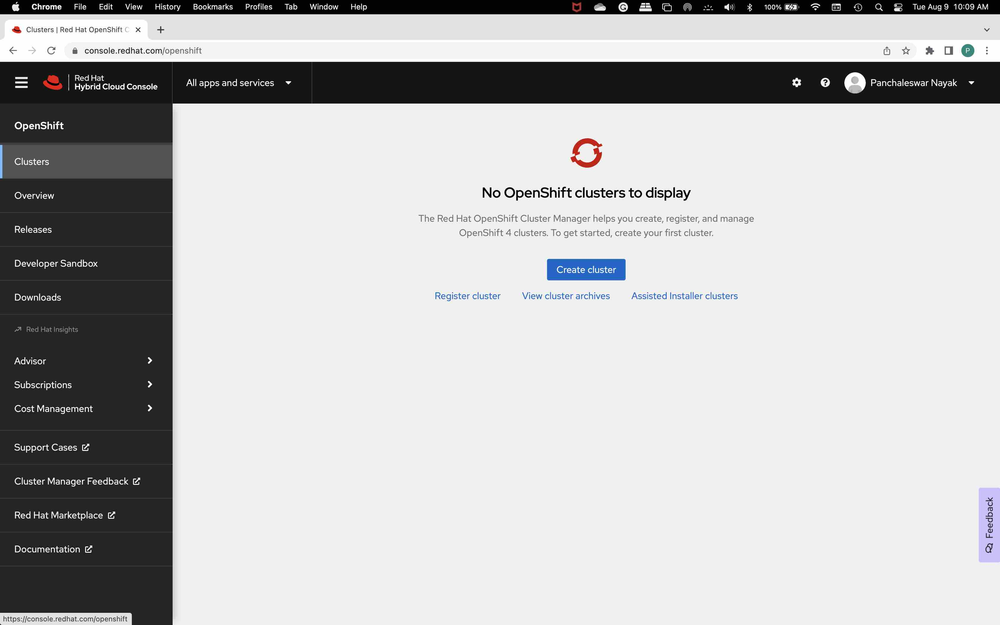
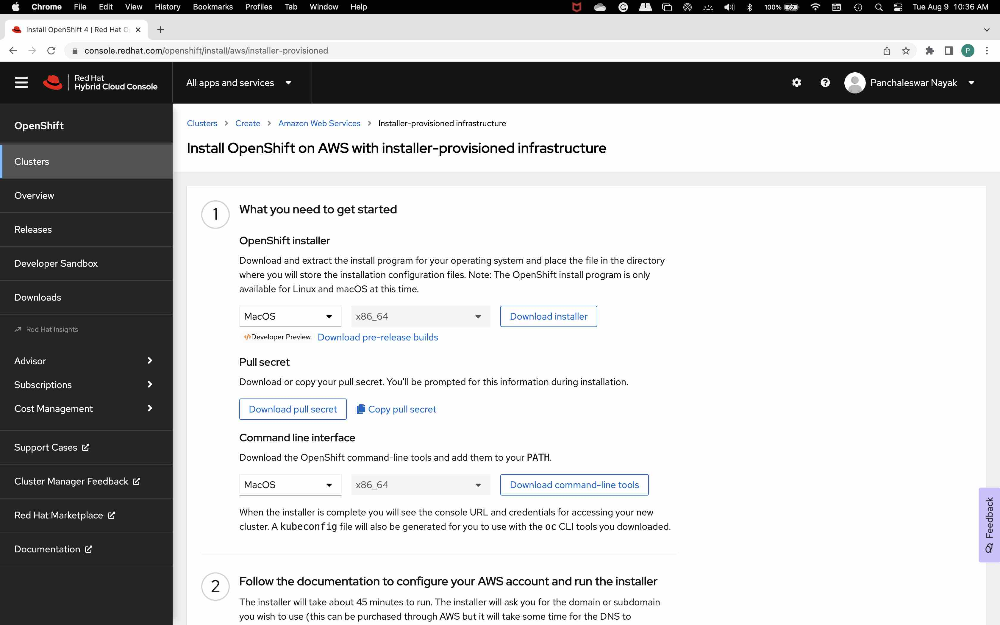

## Install Openshift on AWS

## Prerequisites

1. Obtain the OpenShift Container Platform installation program and the pull secret for your cluster.
2. Obtain service principal permissions at the subscription level.

Step 1. Sign up for a Red Hat subscription 

This Quick Start requires a Red Hat account and valid Red Hat subscription. During the deployment of the Quick Start, you must provide your Red Hat Container Registry pull secret, which is a JSON authentication token. 

https://access.redhat.com/RegistryAuthentication

https://access.redhat.com/RegistryAuthentication#creating-registry-service-accounts-6

# Login to Redhat and create a registry service account

redhat-registry-sa

Username is 7583296|redhat-registry-sa and 

password is the token below:

eyJhbGciOiJSUzUxMiJ9.eyJzdFmOWE1ZmI3ZDM0Yjc5ODFmMzI0OWNmMWM5Y2E5ZCJ9
# Download secret

redhat-registry-sa-secret.yaml

Visit the following link and create an account if you dont have and login.

https://console.redhat.com/openshift/



## Procedure
Create the install-config.yaml file.


### Creating the installation configuration file

./openshift-install create install-config --dir=<installation_directory>

```
cd /Users/pnayak/tech-blog/kubernetes/openshift
./openshift-install create install-config --dir=../config
./openshift-install create cluster --dir=../config
```

Here is a sample install-config.yaml file.

```
apiVersion: v1
baseDomain: example.com 
credentialsMode: Mint 
controlPlane:   
  hyperthreading: Enabled 
  name: master
  platform:
    aws:
      zones:
      - us-east-2a
      - us-west-2b
      rootVolume:
        iops: 4000
        size: 500
        type: io1 
      type: m5.xlarge
  replicas: 3
compute: 
- hyperthreading: Enabled 
  name: worker
  platform:
    aws:
      rootVolume:
        iops: 2000
        size: 500
        type: io1 
      type: m5.xlarge
      zones:
      - us-east-2c
  replicas: 3
metadata:
  name: test-cluster 
networking:
  clusterNetwork:
  - cidr: 10.128.0.0/14
    hostPrefix: 23
  machineNetwork:
  - cidr: 10.0.0.0/16
  networkType: OpenShiftSDN
  serviceNetwork:
  - 172.30.0.0/16
platform:
  aws:
    region: us-east-2 
    userTags:
      adminContact: jdoe
      costCenter: 7536
    amiID: ami-96c6f8f7 
    serviceEndpoints: 
      - name: ec2
        url: https://vpce-id.ec2.us-west-2.vpce.amazonaws.com
fips: false 
sshKey: ssh-ed25519 AAAA... 
pullSecret: '{"auths": ...}' 

```

And here is my simplified install-config.yaml file

```
apiVersion: v1
baseDomain: pnayak.org
credentialsMode: Mint 
controlPlane:   
  hyperthreading: Enabled 
  name: master
  platform:
    aws:
      zones:
      - us-east-2a
      - us-east-2b 
      type: m5.xlarge
  replicas: 1
compute: 
- hyperthreading: Enabled 
  name: worker
  platform:
    aws:
      type: c5.xlarge
      zones:
      - us-east-2a
  replicas: 3
metadata:
  name: panch-os-cluster
platform:
  aws:
    region: us-east-2 
sshKey: ssh-ed25519 AAAA... 
pullSecret: '{"auths": ...}' 
```

Click the Cluster tab and client the create cluster button


Go to Run it Yourself Section and click the Cloud provider Installation options AWS (x86_64)

Then Select an installation type , select "Installer-provisioned infrastructure" to Install OpenShift on AWS with installer-provisioned infrastructure User-provisioned infrastructure.



or "User-provisioned infrastructure" to install OpenShift on AWS with user-provisioned infrastructure


Visit the following Red Hat OpenShift on AWS guide

https://aws.amazon.com/quickstart/architecture/openshift/

Deployment steps 

# Submit the secret to the cluster using this command:

kubectl create -f redhat-registry-sa-secret.yml --namespace=NAMESPACEHERE

# Update Kubernetes configuration

Add a reference to the secret to your Kuberenetes pod config via an imagePullSecrets field. Example:

apiVersion: v1
kind: Pod
metadata:
  name: somepod
  namespace: all
  spec:
    containers:
      - name: web
        image: registry.redhat.io/REPONAME

    imagePullSecrets:
      - name: 7583296-redhat-registry-sa-pull-secret

for docker login 

docker login -u='7583296|redhat-registry-sa' -p=eiJ9.eyJzdWIiOiIzOTFmOWE1ZmI3ZDM0Yjc5ODFmMzI0OWNmMWM5Y2E5ZCJ9.oxx66QT6CEq4I5ifHTHCsaSLI7UmozUFxUgG3mZdBBib8Pqhlt8ODABlSQcSn3KlxJNQ9awCJCecFPzSY1x_4VYPBqmU8yCDKlrrptfZPY2OIhvNxcWmSJ64D_czU0Sftu0iUN0DSfMAmK5neJvnhvdpCLQIllvSB6xOA1IR0j-39lQhYx9IpayzNxms5K2YS9GaGCMA-mMh_qlWLbYEXL5fUDughDDSCH1Un092lmjd-8yBM0jktW6RzZAbGutl8-Hn_YOp0fZCAECVHCFDO3VQOs91Y8M9qveVaI registry.redhat.io

Docker configuration

Download credentials configuration

redhat-registry-sa-auth.json

mv redhat-registry-sa-auth.json ~/.docker/config.json